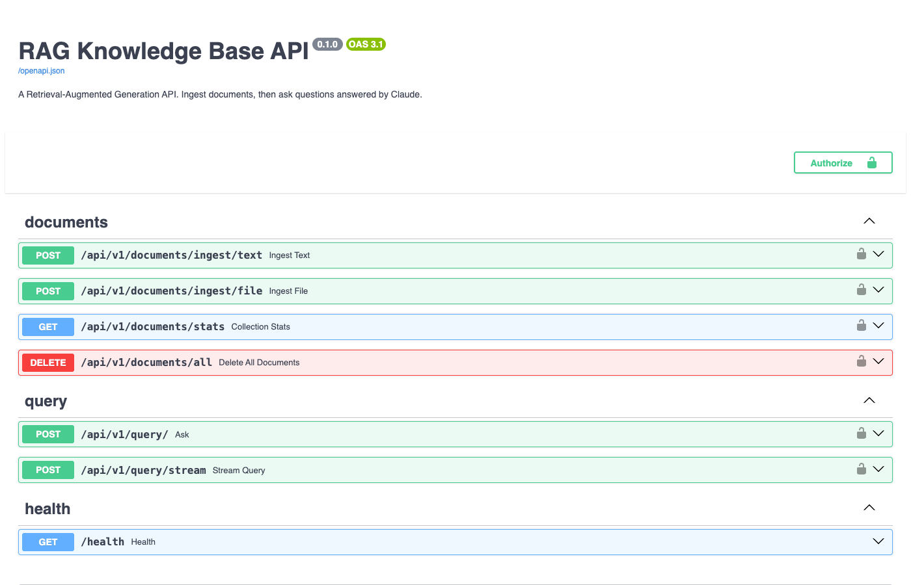

# RAG Knowledge Base — Deep Space Query Engine

> Your documents. Your data. Transmitted across the cosmos grounded in fact, not hallucination.


A self-hosted Retrieval-Augmented Generation (RAG) API — your mission control for intelligent document search. Upload your documents, then broadcast natural-language questions across your knowledge base. The engine locks onto the most relevant passages and deploys Claude to generate a grounded answer backed by your data, not the void of hallucination.



---

## Mission Briefing — Why RAG?

Large language models are powerful but frozen in time — like light from a distant star, they only carry what they knew at launch. They'll confidently fabricate facts from dark matter they were never trained on. Fine-tuning is expensive and goes stale the moment your data changes.

RAG solves both problems: instead of baking knowledge into model weights, it retrieves the relevant passages from *your* documents at query time and hands them to the model as live mission data. The model stays general-purpose; the knowledge stays fresh and under your control.

This project makes that pattern mission-ready — a self-hosted API you can point at any document corpus and query over HTTP, with no data ever leaving your infrastructure.

---

## Flight Plan — How It Works

1. **Dock & Ingest** — upload files (PDF, DOCX, TXT, MD) or POST raw text. Documents are chunked and embedded using a local sentence-transformer model (`all-MiniLM-L6-v2`, ~90 MB, downloads automatically on first launch).
2. **Orbit & Store** — embeddings are persisted in a local FAISS index (`./data/faiss_index/`) that survives server restarts, holding your knowledge in stable orbit.
3. **Transmit & Query** — broadcast a question; the API retrieves the top-k most relevant chunks and sends them as mission context to Claude, which generates an answer without drifting beyond the provided material. A streaming endpoint delivers tokens in real time via Server-Sent Events.

---

## Payload Manifest — Features

- **File ingestion**: PDF, DOCX, DOC, TXT, MD
- **Text ingestion**: POST raw text with optional metadata
- **Batch query**: returns a complete answer + source chunks
- **Streaming query**: token-by-token SSE stream (`sources` → `token`… → `done`)
- **Optional API key auth**: set `API_KEYS` in `.env`; leave it empty to disable (useful for local dev)
- **Fully local embeddings**: no extra API key or external service required for embedding
- **Interactive docs**: Swagger UI at `/docs`, ReDoc at `/redoc`

---

## Pre-Launch Checklist — Requirements

- Python 3.11+
- An [Anthropic API key](https://console.anthropic.com/)

---

## Launch Sequence — Setup

```bash
git clone <your-repo-url>
cd rag-knowledge-base

# Install mission-critical dependencies
pip install -r requirements.txt

# Configure mission parameters
cp .env.example .env
# Edit .env and set ANTHROPIC_API_KEY
```

### Mission Parameters — `.env` Options

| Variable | Default | Description |
|---|---|---|
| `ANTHROPIC_API_KEY` | *(required)* | Your Anthropic API key |
| `CLAUDE_MODEL` | `claude-opus-4-8` | Claude model deployed for answer generation |
| `API_KEYS` | *(empty — auth disabled)* | Comma-separated valid API keys for the `X-API-Key` header |
| `CHUNK_SIZE` | `1000` | Max characters per document chunk |
| `CHUNK_OVERLAP` | `200` | Overlap between consecutive chunks |
| `RETRIEVAL_K` | `5` | Number of chunks to retrieve per query |
| `DEBUG` | `false` | Enable debug logging |

---

## Liftoff — Running

```bash
uvicorn app.main:app --reload
```

Mission Control is now live at `http://localhost:8000`. Visit `http://localhost:8000/docs` for the interactive Swagger UI.

---

## Mission Control — API Endpoints

All endpoints (except `/health`) are prefixed with `/api/v1` and require an `X-API-Key` header if `API_KEYS` is set.

| Method | Path | Description |
|---|---|---|
| `GET` | `/health` | Spacecraft health check |
| `POST` | `/api/v1/documents/ingest/text` | Dock raw text into the knowledge base |
| `POST` | `/api/v1/documents/ingest/file` | Upload and dock a file |
| `GET` | `/api/v1/documents/stats` | Number of vectors in orbit |
| `DELETE` | `/api/v1/documents/all` | Jettison the entire knowledge base |
| `POST` | `/api/v1/query/` | Broadcast a question (full response) |
| `POST` | `/api/v1/query/stream` | Broadcast a question (SSE stream) |

---

## Mission Logs — Example Usage

### Dock Text

```bash
curl -X POST http://localhost:8000/api/v1/documents/ingest/text \
  -H "Content-Type: application/json" \
  -d '{"content": "FastAPI is a modern web framework for Python.", "source": "notes.txt"}'
```

### Dock a File

```bash
curl -X POST http://localhost:8000/api/v1/documents/ingest/file \
  -F "file=@report.pdf"
```

### Transmit a Query

```bash
curl -X POST http://localhost:8000/api/v1/query/ \
  -H "Content-Type: application/json" \
  -d '{"question": "What is FastAPI?", "include_sources": true}'
```

### Stream a Query

```bash
curl -N -X POST http://localhost:8000/api/v1/query/stream \
  -H "Content-Type: application/json" \
  -d '{"question": "What is FastAPI?"}'
```

### Load the NBA Demo Dataset

A script is included to populate the knowledge base with 2026 NBA Playoff data — useful for a quick mission rehearsal:

```bash
python ingest_nba.py
```

### Load the UFC Demo Dataset

Populates the knowledge base with **UFC all-time statistical leaders** sourced directly from [statleaders.ufc.com](https://statleaders.ufc.com/) (data as of June 7, 2026).

```bash
python ingest_ufc.py
```

### Load the FIFA Demo Dataset

Populates the knowledge base with detailed **FIFA World Cup** statistics covering the **last 10 tournaments (1990–2022)** plus all-time records, sourced from Wikipedia's FIFA World Cup records and statistics page.

```bash
python ingest_fifa.py
```

---

## Pre-Launch Diagnostics — Running Tests

Tests mock all external I/O (FAISS, Anthropic) — no API key or network access required.

```bash
pytest
```

---

## Spacecraft Components Tech Stack

- [FastAPI](https://fastapi.tiangolo.com/) — mission command framework
- [LangChain](https://www.langchain.com/) — RAG flight orchestration
- [FAISS](https://github.com/facebookresearch/faiss) — vector constellation search
- [sentence-transformers](https://www.sbert.net/) — onboard local embeddings (`all-MiniLM-L6-v2`)
- [Anthropic Claude](https://www.anthropic.com/) — deep-space answer generation
